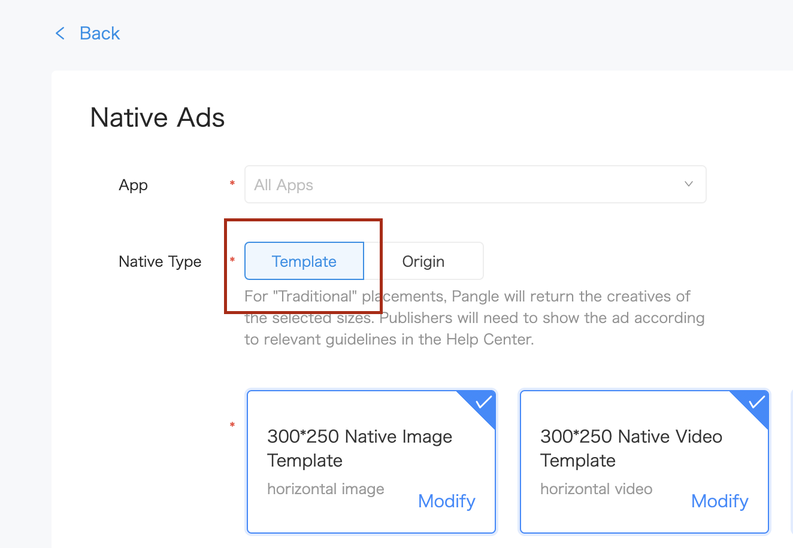

# 2. Native Ads


* [Origin Native Ads](#start/native_ad_origin)
  * [Loading Ads](#start/native_ad_origin_load)
  * [Determining load events](#start/native_ad_origin_loadevent)
  * [Displaying Ads](#start/native_ad_origin_display)
* [Template Native Ads](#start/native_ad_template)
  * [Loading Ads](#start/native_ad_template_load)
  * [Determining load events and Displaying Ads](#start/native_ad_template_loadevent)


This chapter will explain the procedure for displaying the native ads in the application.

Please [integrate Pangle SDK](1-integrate_en.md) before load ads.


<a name="start/native_ad_origin"></a>
## Origin Native Ads

<a name="start/native_ad_origin_load"></a>
### Loading Ads

On Pangle platform, create an **Origin** ad in the app, you will get a **placement ID** for ad's loading.


In your application, create a `slot` for setting size and type for the ad and  use `TTAdNative` to load ads.

```kotlin
class NativeAdsViewActivity : AppCompatActivity() {

    private lateinit var mTTAdNative: TTAdNative

    ...

    override fun onCreate(savedInstanceState: Bundle?) {
        super.onCreate(savedInstanceState)
        setContentView(R.layout.activity_main)

        ...

        requestOriginNativeAd("945538916")
    }


    private fun requestOriginNativeAd(mPlacementID: String) {
        Timber.d(mPlacementID)
        if (mPlacementID.isEmpty()) {
            Timber.e("PlacementId is null")
            return
        }

        //init Pangle ad manager
        val mTTAdManager = TTAdSdk.getAdManager()
        mTTAdNative = mTTAdManager.createAdNative(this)
        val adSlot = AdSlot.Builder()
            .setCodeId(mPlacementID)
            .setSupportDeepLink(true)
            .setAdCount(1)
            .setImageAcceptedSize(300, 250)
            .build()
        mTTAdNative.loadFeedAd(adSlot, mFeedAdListener)
    }


    ...

```

<a name="start/native_ad_origin_loadevent"></a>
### Determining load events

`FeedAdListener` indicates the result of ad's load. If ad is loaded,


```kotlin
private val mFeedAdListener: FeedAdListener = object : FeedAdListener {
    override fun onError(code: Int, message: String) {
        Timber.d("feedAdListener loaded fail .code=$code,message=$message")
    }

    override fun onFeedAdLoad(ads: List<TTFeedAd>) {
        if (ads.isEmpty()) {
            Timber.e("feedAdListener loaded success .but ad no fill ")
            return
        }
        for (nativeAd in ads) {
            val content = CellContentModel()
            content.isAd = true
            content.feedAd = nativeAd
            mContentlist.add(adPosition, content)
            mAdapter.notifyItemInserted(adPosition)
        }
    }
}
```

<a name="start/native_ad_origin_display"></a>
### Displaying Ads

`nativeAd`'s parameters have parts like ad's title, description, images for displaying.

if the parameter`imageMode` in the `nativeAd` is **TTAdConstant.IMAGE_MODE_VIDEO** or **TTAdConstant.IMAGE_MODE_VIDEO_VERTICAL** or
**TTAdConstant.IMAGE_MODE_VIDEO_SQUARE**, please set `adView` to display video for the ad.

`TTAdDislike` is for getting user's feedback, please add a button on the ad's view to show `TTNativeAd.getDislikeDialog` to get the feedback.


```kotlin
override fun onBindViewHolder(
    holder: RecyclerAdapter.RecyclerAdapterViewHolder,
    position: Int
) {
    if (getItemViewType(position) == TYPE_NORMAL) {
        holder.view.item_name.text = contentList[position].content
    } else {

        /**
         *  here is to set native ad's date to the view
         */
        var ad: TTFeedAd = contentList[position].feedAd
        holder.view.titleText.text = ad.title
        holder.view.descText.text = ad.description
        holder.view.adButton.text = ad.buttonText
        Glide.with(holder.view).asBitmap().load(ad.icon.imageUrl).into(holder.view.logoView)

        // this is video ad
        if (ad.imageMode == TTAdConstant.IMAGE_MODE_VIDEO || ad.imageMode == TTAdConstant.IMAGE_MODE_VIDEO_SQUARE || ad.imageMode == TTAdConstant.IMAGE_MODE_VIDEO_VERTICAL) {
            var videoAd = ad.adView
            if (videoAd != null) {
                Timber.d("video exist")
                holder.view.containerFrame.addView(ad.adView)
            } else {
                Timber.d("video not exist")
                val imageView = ImageView(holder.view.context)
                Glide.with(holder.view).asBitmap().load(ad.imageList[0].imageUrl)
                    .into(imageView)
                holder.view.containerFrame.addView(imageView)
            }
        } else {
            // this is an image ad
            val imageView = ImageView(holder.view.context)
            Glide.with(holder.view).asBitmap().load(ad.imageList[0].imageUrl).into(imageView)
            holder.view.containerFrame.addView(imageView)
        }

        // Pangle logo view
        holder.view.adLogoView.setImageBitmap(ad.adLogo)
        holder.view.adLogoView.bringToFront()

        // set dislike button on top
        holder.view.dislikeButton.bringToFront()
        bindDislikeAction(ad, holder.view.dislikeButton, holder)

        // register the view for click
        ad.registerViewForInteraction(
            holder.view as ViewGroup,
            holder.view.adButton,
            mTTNativeAdListener
        )
    }
}

private val mTTNativeAdListener: TTNativeAd.AdInteractionListener =
    object : TTNativeAd.AdInteractionListener {
        override fun onAdClicked(p0: View?, p1: TTNativeAd?) {
            Timber.d("onAdClicked")
        }

        override fun onAdCreativeClick(p0: View?, p1: TTNativeAd?) {
            Timber.d("onAdCreativeClick")
        }

        override fun onAdShow(p0: TTNativeAd?) {
            Timber.d("onAdShow")
        }

    }

override fun getItemCount(): Int {
    return contentList.size
}

override fun getItemViewType(position: Int): Int {
    return if (!contentList[position].isAd) {
        TYPE_NORMAL
    } else {
        Timber.d("isAD!!")
        TYPE_AD
    }
}

companion object {
    private const val TYPE_NORMAL = 1
    private const val TYPE_AD = 2
}

private fun bindDislikeAction(
    ad: TTNativeAd,
    dislikeView: View,
    holder: RecyclerAdapter.RecyclerAdapterViewHolder
) {
    val ttAdDislike: TTAdDislike = ad.getDislikeDialog(dislikeView.context as Activity)
    ttAdDislike?.setDislikeInteractionCallback(object : DislikeInteractionCallback {
        override fun onSelected(position: Int, value: String) {
            // here to notify the recycleview to close the adapter
            contentList.removeAt(holder.layoutPosition)
            notifyDataSetChanged()
        }

        override fun onCancel() {
            Timber.d("onCancel")
        }
    })
    dislikeView.setOnClickListener { ttAdDislike?.showDislikeDialog() }
}
```


<a name="start/native_ad_template"></a>
## Template Native Ads

<a name="start/native_ad_template_load"></a>
## Loading Ads

On Pangle platform, create an **Template** ad in the app, you will get a **placement ID** for ad's loading.



In your application, create a `slot` and set the size by `setExpressViewAcceptedSize`, use `TTNativeAd`'s
`void loadNativeExpressAd(AdSlot var1, @NonNull TTAdNative.NativeExpressAdListener var2);` to load the ad.
SDK will return a same size's ad.

```kotlin

fun requestTemplateNativeAd(mPlacementID: String) {
    Timber.d(mPlacementID)
    if (mPlacementID.isEmpty()) {
        Timber.e("PlacementId is null")
        return
    }

    //init Pangle ad manager
    val mTTAdManager = TTAdSdk.getAdManager()
    val mTTAdNative = mTTAdManager.createAdNative(this)
    val adSlot = AdSlot.Builder()
        .setCodeId(mPlacementID)
        .setSupportDeepLink(true)
        .setAdCount(1)
        .setExpressViewAcceptedSize(300F, 250F)
        .build()
    mTTAdNative.loadNativeExpressAd(adSlot, mTTNativeExpressAdListener)
}
```


<a name="start/native_ad_template_loadevent"></a>
## Determining load events and Displaying Ads

`NativeExpressAdListener` indicates the result of ad's load. If ad is loaded, **must call `render()` for rending the ad.**

The result of render will be indicated by `ExpressAdInteractionListener`, ad's view will be passed in `onRenderSuccess`.

```kotlin
private val mTTNativeExpressAdListener: NativeExpressAdListener =
    object : NativeExpressAdListener {
        override fun onError(code: Int, message: String) {
            Timber.d("NativeExpressAdListener loaded fail .code=$code,message=$message")
        }

        override fun onNativeExpressAdLoad(ads: List<TTNativeExpressAd>) {
            if (ads == null || ads.isEmpty()) {
                return
            }
            mTTNativeExpressAd = ads[0]
            mTTNativeExpressAd.setExpressInteractionListener(mExpressAdInteractionListener)
            bindDislike(mTTNativeExpressAd)
            mTTNativeExpressAd.render()
        }
    }

private val mExpressAdInteractionListener: ExpressAdInteractionListener =
    object : ExpressAdInteractionListener {
        override fun onAdClicked(view: View, type: Int) {
            Timber.d("onAdClicked")
        }

        override fun onAdShow(view: View, type: Int) {
            Timber.d("onAdShow")
        }

        override fun onRenderFail(view: View, msg: String, code: Int) {
            Timber.d("onRenderFail .code=$code,message=$msg")
        }

        override fun onRenderSuccess(view: View, width: Float, height: Float) {
            Timber.d("onRenderSuccess")
            val content = CellContentModel()
            content.isAd = true
            content.templateAd = view
            mContentlist.add(adPosition,content)
            mAdapter.notifyItemInserted(adPosition)

        }
    }
```

Please implement `TTNativeExpressAd` 's `void setDislikeCallback(Activity var1, DislikeInteractionCallback var2);` when user click the `dislike` button to get user's feedback. You can remove the ad's view after the user choose one reason why he doesn't like the ad.

```kotlin
private fun bindDislike(ad: TTNativeExpressAd) {
    ad.setDislikeCallback(this, object : DislikeInteractionCallback {
        override fun onSelected(position: Int, value: String) {
            Timber.d("onSelected")
            mContentlist.removeAt(adPosition)
            mAdapter.notifyDataSetChanged()
        }

        override fun onCancel() {}
    })
}
```
