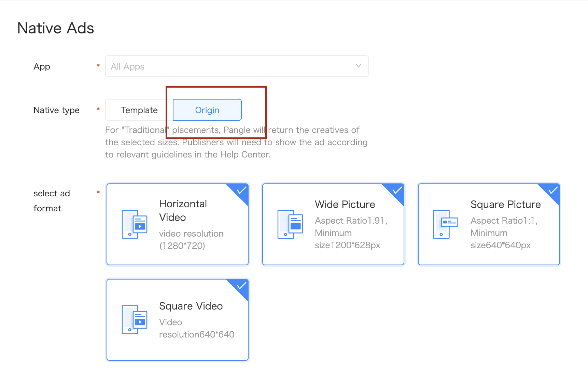

# 2. Native Ads


* [Origin Native Ads](#start/native_ad_origin)
  * [Loading Ads](#start/native_ad_origin_load)
  * [Determining load events](#start/native_ad_origin_loadevent)
  * [Displaying Ads](#start/native_ad_origin_display)
* [Template Native Ads](#start/native_ad_template)
  * [Loading Ads](#start/native_ad_template_load)
  * [Determining load events](#start/native_ad_template_loadevent)
  * [Displaying Ads](#start/native_ad_template_display)


This chapter will explain the procedure for displaying the native ads in the application.

Please [integrate Pangle SDK](1-integrate_en.md) before load ads.


<a name="start/native_ad_origin"></a>
## Origin Native Ads

<a name="start/native_ad_origin_load"></a>
### Loading Ads

On Pangle platform, create an **Origin** ad in the app, you will get a **placement ID** for ad's loading.




In your application, create a `slot` for setting size and type for the ad and  use `TTAdNative` to load ads.

```kotlin
class NativeAdsViewActivity : AppCompatActivity() {

    private lateinit var mTTAdNative: TTAdNative

    ...

    override fun onCreate(savedInstanceState: Bundle?) {
        super.onCreate(savedInstanceState)
        setContentView(R.layout.activity_main)

        ...

        requestOriginNativeAd("945538916")
    }


    private fun requestOriginNativeAd(mPlacementID: String) {
        Timber.d(mPlacementID)
        if (mPlacementID.isEmpty()) {
            Timber.e("PlacementId is null")
            return
        }

        //init Pangle ad manager
        val mTTAdManager = TTAdSdk.getAdManager()
        mTTAdNative = mTTAdManager.createAdNative(this)
        val adSlot = AdSlot.Builder()
            .setCodeId(mPlacementID)
            .setSupportDeepLink(true)
            .setAdCount(1)
            .setImageAcceptedSize(300, 250)
            .build()
        mTTAdNative.loadFeedAd(adSlot, mFeedAdListener)
    }


    ...

```

<a name="start/native_ad_origin_loadevent"></a>
### Determining load events

`FeedAdListener` indicates the result of ad's load. If ad is loaded,


```kotlin
private val mFeedAdListener: FeedAdListener = object : FeedAdListener {
    override fun onError(code: Int, message: String) {
        Timber.d("feedAdListener loaded fail .code=$code,message=$message")
    }

    override fun onFeedAdLoad(ads: List<TTFeedAd>) {
        if (ads.isEmpty()) {
            Timber.e("feedAdListener loaded success .but ad no fill ")
            return
        }
        for (nativeAd in ads) {
            val content = CellContentModel()
            content.isAd = true
            content.feedAd = nativeAd
            mContentlist.add(adPosition, content)
            mAdapter.notifyItemInserted(adPosition)
        }
    }
}
```

<a name="start/native_ad_origin_display"></a>
### Displaying Ads

`nativeAd`'s parameters have parts like ad's title, description, images for displaying.

if the parameter`imageMode` in the `nativeAd` is **TTAdConstant.IMAGE_MODE_VIDEO** or **TTAdConstant.IMAGE_MODE_VIDEO_VERTICAL** or
**TTAdConstant.IMAGE_MODE_VIDEO_SQUARE**, please set `adView` to display video for the ad.


```kotlin
override fun onBindViewHolder(
    holder: RecyclerAdapter.RecyclerAdapterViewHolder,
    position: Int
) {
    if (getItemViewType(position) == TYPE_NORMAL) {
        holder.view.item_name.text = contentList[position].content
    } else {
        var ad: TTFeedAd = contentList[position].feedAd
        holder.view.titleText.text = ad.title
        holder.view.descText.text = ad.description
        holder.view.adButton.text = ad.buttonText
        Glide.with(holder.view).asBitmap().load(ad.icon.imageUrl).into(holder.view.logoView)

        ad.imageMode == TTAdConstant.AD_TYPE_COMMON_VIDEO


        var videoAd = ad.adView
        if (videoAd != null) {
            Timber.d("video ad")
            holder.view.containerFrame.addView(ad.adView)
        } else {
            Timber.d("image ad")
            val imageView = ImageView(holder.view.context)

            Glide.with(holder.view).asBitmap().load(ad.imageList[0].imageUrl).into(imageView)
            holder.view.containerFrame.addView(imageView)
        }

        holder.view.adLogoView.setImageBitmap(ad.adLogo)

        // register the view for click
        ad.registerViewForInteraction(holder.view as ViewGroup,holder.view.adButton, mTTNativeAdListener)
    }
}
```


<a name="start/native_ad_template"></a>
## Template Native Ads

<a name="start/native_ad_template"></a>
## Loading Ads

On Pangle platform, create an **Template** ad in the app, you will get a **placement ID** for ad's loading.


In your application, create a `slot` for setting size and type for the ad and use `BUNativeExpressAdManager`'s
`- (instancetype)initWithSlot:(BUAdSlot * _Nullable)slot adSize:(CGSize)size;`
Set the size for the ad's view in function. SDK will return an same size's ad.

```swift
/**
 for template native ad
 */
var templateAdManager: BUNativeExpressAdManager!

//placementID : the ID when you created a placement
//count: the counts you want to download,DO NOT set more than 3
func requestTemplateNativeAds(placementID:String, count:Int) {
    let slot = BUAdSlot.init()
    slot.id = placementID
    slot.adType = BUAdSlotAdType.feed
    slot.position = BUAdSlotPosition.feed
    slot.imgSize = BUSize.init()
    slot.isSupportDeepLink = true
    // Please set your ad view's size here
    let adViewWidth = 300
    let adViewHeight = 250
    templateAdManager = BUNativeExpressAdManager.init(slot: slot, adSize: CGSize(width: adViewWidth, height: adViewHeight))
    templateAdManager.delegate = self
    templateAdManager.loadAd(count)
}
```


<a name="start/native_ad_template_loadevent"></a>
## Determining load events

`BUNativeExpressAdViewDelegate` indicates the result of ad's load. If ad is loaded,
**must call `render()` for rending the ad.**

```swift
// MARK:  BUNativeExpressAdViewDelegate
extension YourNativeAdsViewController: BUNativeExpressAdViewDelegate {
    func nativeExpressAdSuccess(toLoad nativeExpressAd: BUNativeExpressAdManager, views: [BUNativeExpressAdView]) {
        for templateAdView in views {
            // set rootViewController for ad's showing
            templateAdView.rootViewController = self
            templateAdView.render()
        }
    }

    func nativeExpressAdFail(toLoad nativeExpressAd: BUNativeExpressAdManager, error: Error?) {
        print("\(#function)  load template failed with error: \(String(describing: error?.localizedDescription))")
    }
}
```

<a name="start/native_ad_template_display"></a>
## Displaying Ads

If `render()` succeed, ad will be sent to `BUNativeExpressAdViewDelegate`'s `- (void)nativeExpressAdViewRenderSuccess:(BUNativeExpressAdView *)nativeExpressAdView;`.

**Please set `rootViewController` for enabling ad's action.**

If user clicked close button and choose the reason, `func nativeExpressAdView(_ nativeExpressAdView: BUNativeExpressAdView, dislikeWithReason filterWords: [BUDislikeWords])` will be called.


```swift
// MARK:  BUNativeExpressAdViewDelegate
extension YourNativeAdsViewController: BUNativeExpressAdViewDelegate {
    func nativeExpressAdViewRenderSuccess(_ nativeExpressAdView: BUNativeExpressAdView) {
        // here to add nativeExpressAdView for displaying
        contents.insert(nativeExpressAdView, at: adPosition)
        nativeExpressAdView.rootViewController = self
        self.tableView.reloadData()
    }

    func nativeExpressAdViewRenderFail(_ nativeExpressAdView: BUNativeExpressAdView, error: Error?) {
        print("\(#function)  render failed with error: \(String(describing: error?.localizedDescription))")
    }

    func nativeExpressAdView(_ nativeExpressAdView: BUNativeExpressAdView, dislikeWithReason filterWords: [BUDislikeWords]) {
    // do the action (e.g. remove the ad) if ad's dislike reason is been clicked
    }
}
```
