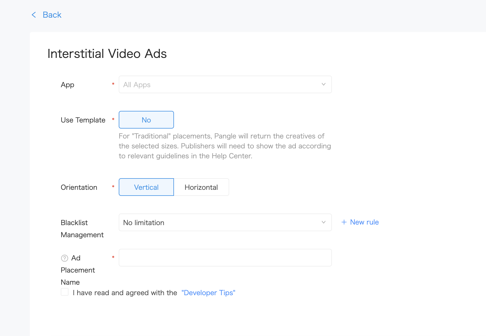

# 4. Full Screen Video Ads


* [Full Screen Video Ads](#start/fullscreen_ad)
  * [Loading Ads](#start/fullscreen_load)
  * [Determining load events and Displaying the ad](#start/fullscreen_loadevent)


This chapter will explain the procedure for displaying the full screen video ads in the application.

Please [integrate Pangle SDK](1-integrate_en.md) before load ads.


<a name="start/fullscreen_ad"></a>
## Full Screen Video Ads

<a name="start/fullscreen_load"></a>
### Full Screen Ads

On Pangle platform, create an **Interstitial Video Ads** ad in the app, you will get a **placement ID** for ad's loading.

Please set the ad's `Orientation` to fit for the app.


  <br>




In your application, create a `TTAdNative` and set the ad's parameter in a `AdSlot`, use `TTAdNative`'s `void loadFullScreenVideoAd(AdSlot var1, @NonNull TTAdNative.FullScreenVideoAdListener var2);` to load the ad.


```kotlin
class FullScreenVideoAdsActivity : AppCompatActivity() {
    override fun onCreate(savedInstanceState: Bundle?) {
        super.onCreate(savedInstanceState)
        ...

        requestFullScreenVideoAd("945277276")
    }

    private fun requestFullScreenVideoAd(mPlacementID: String) {

        if (mPlacementID.isEmpty()) {
            Timber.e("PlacementId is null")
            return
        }

        //init Pangle ad manager
        val mTTAdManager = TTAdSdk.getAdManager()
        val mTTAdNative = mTTAdManager.createAdNative(this)
        val adSlot = AdSlot.Builder()
            .setCodeId(mPlacementID)
            .setSupportDeepLink(true)
            .setImageAcceptedSize(1080, 1920)
            .setOrientation(TTAdConstant.VERTICAL) //required parameter ，Set how you wish the video ad to be displayed ,choose from TTAdConstant.HORIZONTAL or TTAdConstant.VERTICAL
            .build()
        mTTAdNative.loadFullScreenVideoAd(adSlot, mTTFullScreenAdListener)
    }

    ...
}

```

<a name="start/fullscreen_loadevent"></a>
### Determining load events and Displaying

`FullScreenVideoAdListener` indicates the result of ad's load. If ad is loaded, call `TTFullScreenVideoAd`'s `void showFullScreenVideoAd(Activity var1);`' to display the ad.

```kotlin
private val mTTFullScreenAdListener: FullScreenVideoAdListener =
    object : FullScreenVideoAdListener {
        override fun onError(i: Int, s: String) {
            Timber.d("NativeExpressAdListener loaded fail .code=$s,message=$i")
        }

        override fun onFullScreenVideoAdLoad(ttFullScreenVideoAd: TTFullScreenVideoAd) {
            ttFullScreenVideoAd.showFullScreenVideoAd(this@FullScreenVideoAdsActivity)
        }

        override fun onFullScreenVideoCached() {}
    }
```
