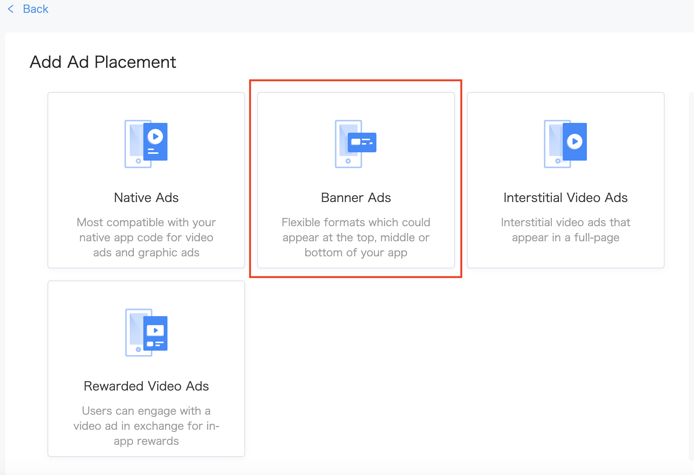
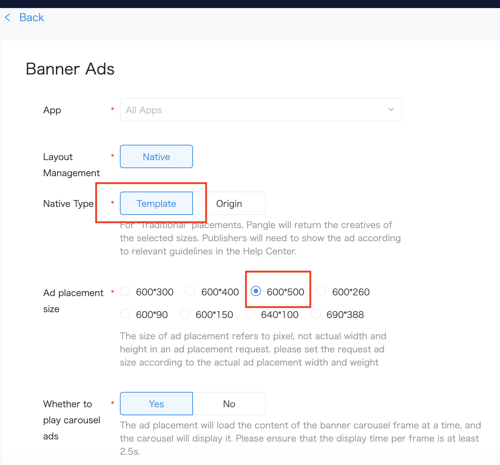

# 5. Template Banner Ads


* [Template Banner Ads](#start/template_banner_ad)
  * [Support SDK Verion](#start/template_banner_support_version)
  * [Loading Ads](#start/template_banner_ad_load)
  * [Determining load events and Displaying](#start/template_banner_ad_loadevent)


This chapter will explain the procedure for displaying the template banner in the application.

Please [integrate Pangle SDK](1-integrate_en.md) before load ads.


<a name="start/template_banner_ad"></a>
## Template Banner Ads

<a name="start/template_banner_support_version"></a>
### Support SDK Verion
Please Use the following sdk for template banner
 - Pangle Android SDK 3.1.7.0 or later

<a name="start/template_banner_ad_load"></a>
### Loading Ads

On Pangle platform, create an **Template Banner** ad in the app.

Plase set **Template** at [Native type].

You will get a **placement ID** for ad's loading.



**Please select [600 * 500]  for 300*250.**



**Please select [640 * 100]  for 320*50.**


In your application, create a `slot` and use `setExpressViewAcceptedSize` for setting size and use `TTAdNative`'s `void loadBannerExpressAd(AdSlot var1, @NonNull TTAdNative.NativeExpressAdListener var2);`' to load ads.

**Please set this size to 300 * 250 or 320 * 50**


```kotlin
class TemplateBannerAdsActivity : AppCompatActivity() {

    private lateinit var mTTTemplateBannerAd: TTNativeExpressAd

    override fun onCreate(savedInstanceState: Bundle?) {
        super.onCreate(savedInstanceState)
        setContentView(R.layout.activity_template_banner_ads)

        requestTemplateBannerAd("your placement id")
    }

    fun requestTemplateBannerAd(mPlacementID: String) {
        Timber.d(mPlacementID)
        if (mPlacementID.isEmpty()) {
            Timber.e("PlacementId is null")
            return
        }

        //init Pangle ad manager
        val mTTAdManager = TTAdSdk.getAdManager()
        val mTTAdNative = mTTAdManager.createAdNative(this)
        val adSlot = AdSlot.Builder()
            .setCodeId(mPlacementID)
            .setSupportDeepLink(true)
            .setAdCount(1)
            .setExpressViewAcceptedSize(300F, 250F)
            .build()
        mTTAdNative.loadBannerExpressAd(adSlot, mTTBannerNativeExpressAdListener)
    }

    ...
}

```

<a name="start/template_banner_ad_loadevent"></a>
### Determining load events and Displaying

`NativeExpressAdListener` indicates the result of ad's load. If ad is loaded, please bind dislike to the `TTNativeExpressAd` for user's feedback to the ad, and call 'render()' to render the ad.

 `ExpressAdInteractionListener` will return the ad's render result. If render succeed, you will get a ad view to display.

```kotlin
private val mTTBannerNativeExpressAdListener: NativeExpressAdListener =
    object : NativeExpressAdListener {
        override fun onError(code: Int, message: String) {
            Timber.d("NativeExpressAdListener loaded fail .code=$code,message=$message")
        }

        override fun onNativeExpressAdLoad(ads: List<TTNativeExpressAd>) {
            if (ads == null || ads.isEmpty()) {
                return
            }
            mTTTemplateBannerAd = ads[0]
            mTTTemplateBannerAd.setExpressInteractionListener(mExpressAdInteractionListener)
            bindDislike(mTTTemplateBannerAd)
            mTTTemplateBannerAd.render()
        }
    }

private val mExpressAdInteractionListener: ExpressAdInteractionListener =
    object : ExpressAdInteractionListener {
        override fun onAdClicked(view: View, type: Int) {
            Timber.d("onAdClicked")
        }

        override fun onAdShow(view: View, type: Int) {
            Timber.d("onAdShow")
        }

        override fun onRenderFail(view: View, msg: String, code: Int) {
            Timber.d("onRenderFail .code=$code,message=$msg")
        }

        override fun onRenderSuccess(view: View, width: Float, height: Float) {
            Timber.d("onRenderSuccess")
            bannerFrame.addView(view)
        }
    }

private fun bindDislike(ad: TTNativeExpressAd) {
    ad.setDislikeCallback(this, object : TTAdDislike.DislikeInteractionCallback {
        override fun onSelected(position: Int, value: String) {
            Timber.d("onSelected")
            bannerFrame.removeAllViews()
        }

        override fun onCancel() {}
    })
}
```
