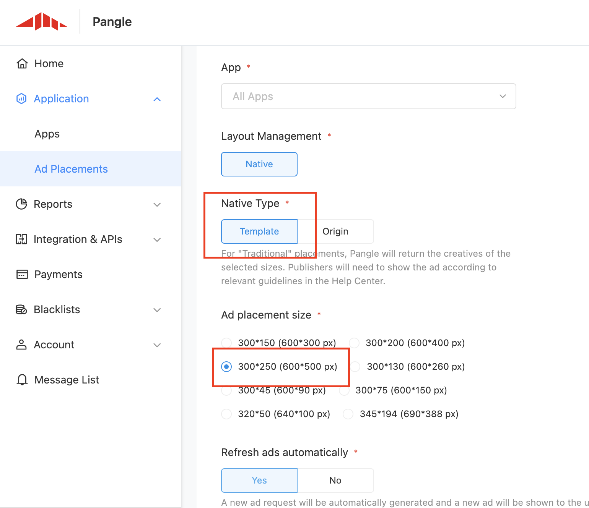
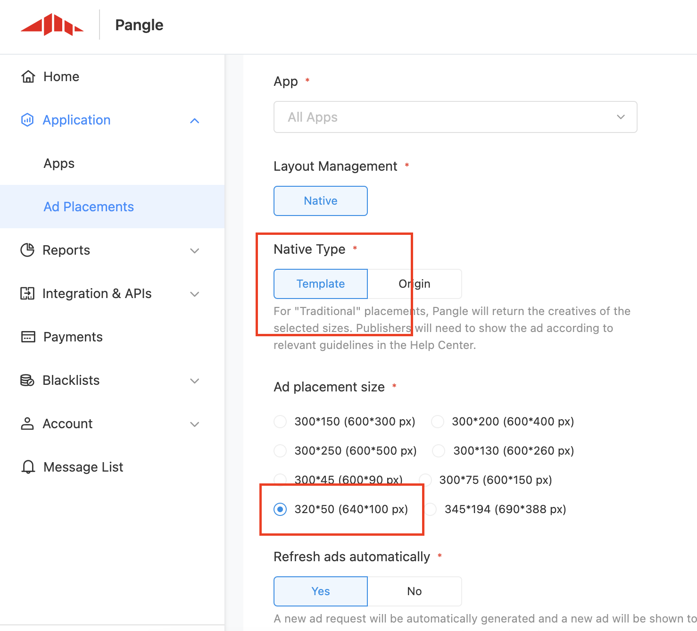

# 5. テンプレートバナー広告


* [テンプレートバナー広告](#start/template_banner_ad)
  * [必要なSDKバージョン](#start/template_banner_support_version)
  * [テンプレートバナー広告のロード](#start/template_banner_ad_load)
  * [ロードイベントの受信と広告の表示](#start/template_banner_ad_loadevent)


この章では、テンプレートバナー広告を表示する手順について説明します。

広告を利用するには、SDKを有効にする必要があります。詳細は[インストールと初期化](1-integrate_ja.md) をご確認ください。


<a name="start/template_banner_ad"></a>
## テンプレートバナー広告

<a name="start/template_banner_support_version"></a>
### 必要なSDKバージョン
以下のSDKバージョンでテンプレートバナー広告をサポートできます。
 - Pangle Android SDK 3.1.7.0 or higher

<a name="start/template_banner_ad_load"></a>
### テンプレートバナー広告のロード

Pangle管理画面上にて, 対象アプリに属する**Template Banner** 広告を新規してください。
[Native type]に **Template** を選んでください。

新規したらその広告枠の **placement ID** が生成されます。


**300*250をご利用の場合、300 * 250 (600 * 500 px) を選んでください.**



**320*50をご利用の場合、320 * 50 (640 * 100 px) を選んでください.**



アプリケーションで、 `slot`を作成し、` setExpressViewAcceptedSize`を使用してサイズを設定し、 `TTAdNative`の` void loadBannerExpressAd（AdSlot var1、@ NonNull TTAdNative.NativeExpressAdListener var2）; `'を使用して広告を読み込みます。


**サイズは300 * 250 または 320 * 50を設定してください。**


```kotlin
class TemplateBannerAdsActivity : AppCompatActivity() {

    private lateinit var mTTTemplateBannerAd: TTNativeExpressAd

    override fun onCreate(savedInstanceState: Bundle?) {
        super.onCreate(savedInstanceState)
        setContentView(R.layout.activity_template_banner_ads)

        requestTemplateBannerAd("your placement id")
    }

    fun requestTemplateBannerAd(mPlacementID: String) {
        Timber.d(mPlacementID)
        if (mPlacementID.isEmpty()) {
            Timber.e("PlacementId is null")
            return
        }

        //init Pangle ad manager
        val mTTAdManager = TTAdSdk.getAdManager()
        val mTTAdNative = mTTAdManager.createAdNative(this)
        val adSlot = AdSlot.Builder()
            .setCodeId(mPlacementID)
            .setAdCount(1)
            .setExpressViewAcceptedSize(300F, 250F)
            .build()
        mTTAdNative.loadBannerExpressAd(adSlot, mTTBannerNativeExpressAdListener)
    }

    ...
}

```

<a name="start/template_banner_ad_loadevent"></a>
### ロードイベントの受信と広告の表示

`NativeExpressAdListener`は、広告の読み込みの結果を示します。 広告が読み込まれている場合は、ユーザーにフィードバック機能を与える`dislike`を「TTNativeExpressAd」にバインドし、`render（）`を呼び出して広告をレンダリングしてください。

`ExpressAdInteractionListener`は、広告のレンダリング結果を返します。 レンダリングが成功すると、表示する広告ビューを受け取れます。


```kotlin
private val mTTBannerNativeExpressAdListener: NativeExpressAdListener =
    object : NativeExpressAdListener {
        override fun onError(code: Int, message: String) {
            Timber.d("NativeExpressAdListener loaded fail .code=$code,message=$message")
        }

        override fun onNativeExpressAdLoad(ads: List<TTNativeExpressAd>) {
            if (ads == null || ads.isEmpty()) {
                return
            }
            mTTTemplateBannerAd = ads[0]
            mTTTemplateBannerAd.setExpressInteractionListener(mExpressAdInteractionListener)
            bindDislike(mTTTemplateBannerAd)
            mTTTemplateBannerAd.render()
        }
    }

private val mExpressAdInteractionListener: ExpressAdInteractionListener =
    object : ExpressAdInteractionListener {
        override fun onAdClicked(view: View, type: Int) {
            Timber.d("onAdClicked")
        }

        override fun onAdShow(view: View, type: Int) {
            Timber.d("onAdShow")
        }

        override fun onRenderFail(view: View, msg: String, code: Int) {
            Timber.d("onRenderFail .code=$code,message=$msg")
        }

        override fun onRenderSuccess(view: View, width: Float, height: Float) {
            Timber.d("onRenderSuccess")
            bannerFrame.addView(view)
        }
    }

private fun bindDislike(ad: TTNativeExpressAd) {
    ad.setDislikeCallback(this, object : TTAdDislike.DislikeInteractionCallback {
        override fun onSelected(position: Int, value: String) {
            Timber.d("onSelected")
            bannerFrame.removeAllViews()
        }

        override fun onCancel() {}
    })
}
```
